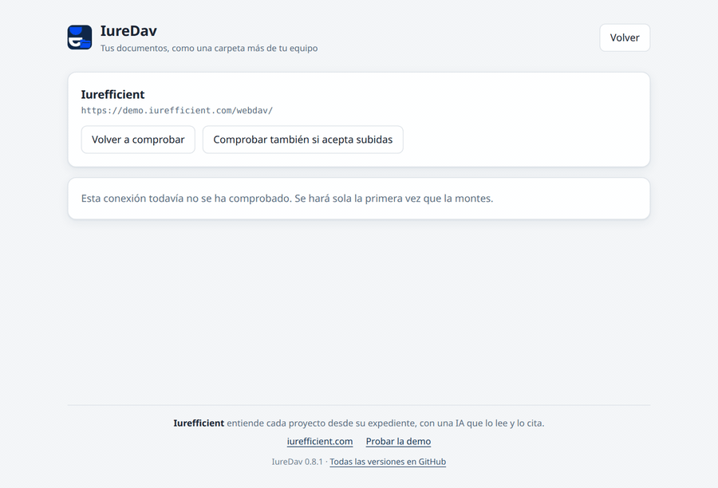
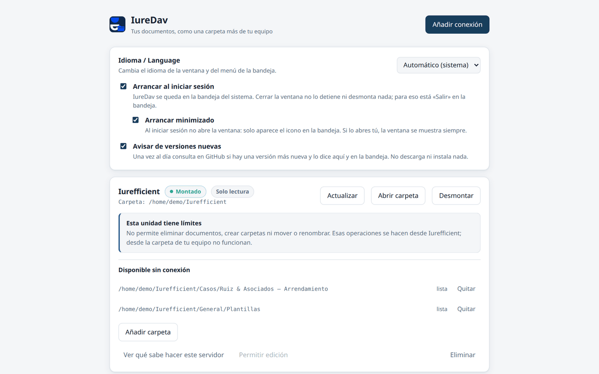
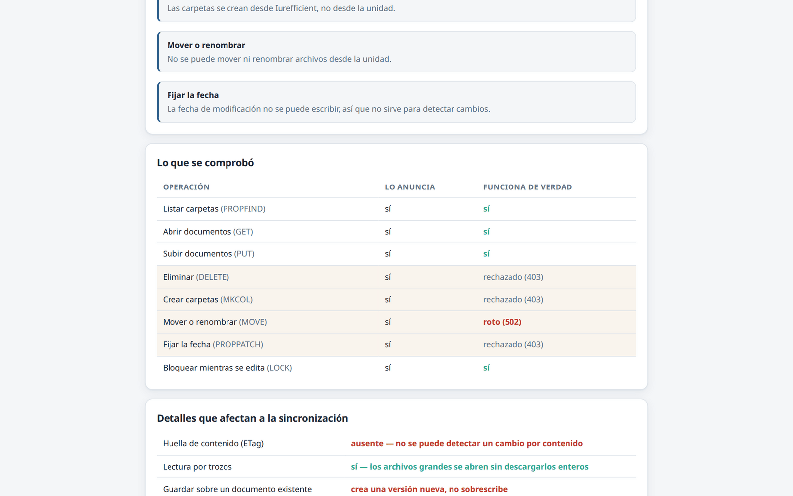
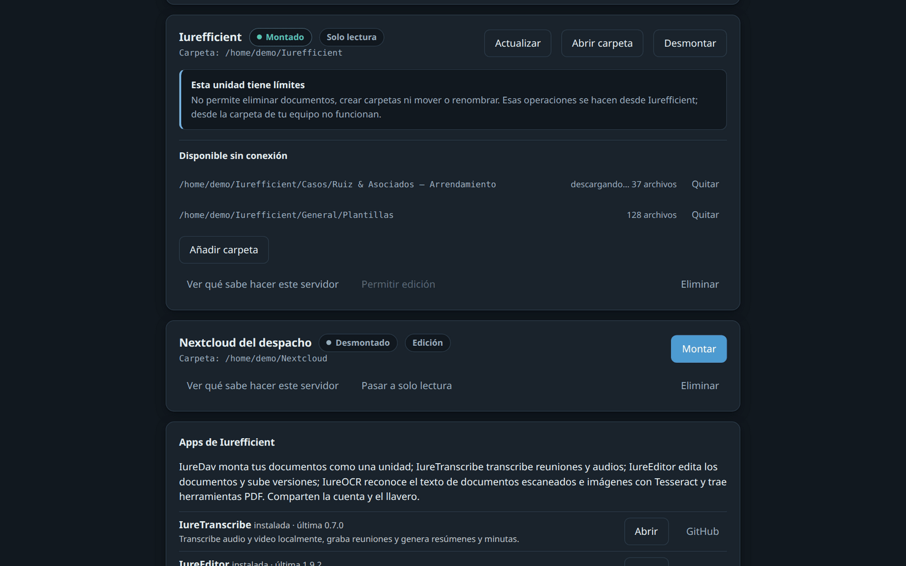
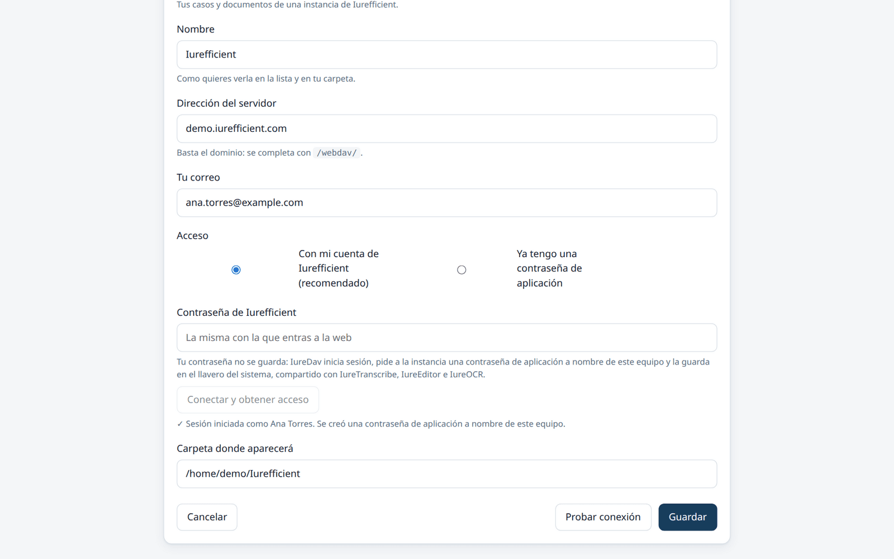

[Read in English](README.md)

<p align="center">
  
</p>
<h1 align="center">IureDav</h1>
<p align="center">
  Tu servidor WebDAV (o Iurefficient) como una carpeta más de tu equipo, montado solo después de comprobar lo que el servidor hace de verdad.
</p>
<p align="center">
  <a href="https://github.com/ellaguno/iuredav/releases/latest"></a>
  <a href="https://github.com/ellaguno/iuredav/releases"></a>
  <a href="LICENSE"></a>
  
  <a href="https://github.com/ellaguno/iuredav/actions/workflows/ci.yml"></a>
</p>
<p align="center">
  <a href="https://github.com/ellaguno/iuredav/releases/latest"><b>Descargar para Linux · Windows · macOS</b></a>
</p>

<p align="center">
  
</p>

Monta un servidor WebDAV como una unidad de tu equipo, al estilo de Mountain Duck.
Linux, macOS y Windows. Con un perfil optimizado para **Iurefficient**.

A diferencia de otros clientes, IureDav **no se cree lo que el servidor anuncia**:
prueba cada operación, mide lo que funciona de verdad, y de ahí deduce cómo montar
la unidad y qué explicarte cuando algo no se puede hacer.

> **Estado: en desarrollo.** Funcionan la sonda, el montaje, la interfaz gráfica,
> la bandeja del sistema, el autoarranque y los instaladores de las tres
> plataformas, y las carpetas disponibles sin conexión.
>
> Probado de verdad solo en Linux. Windows y macOS **compilan y se empaquetan en
> integración continua**. Windows ya se ha usado en máquinas reales (varias
> correcciones del [CHANGELOG](CHANGELOG.md) salen de ahí), mucho menos que
> Linux; la versión de macOS nadie la ha ejecutado todavía en una Mac real.

## ¿Por qué IureDav?

- **Mide en vez de creer.** Cada operación WebDAV se prueba de verdad; un
  servidor que promete `DELETE` o `MOVE` y luego falla no puede dejar la unidad
  rota a mitad de una copia o un renombrado.
- **Límites explicados en palabras llanas.** No «403 en MKCOL», sino «no permite
  crear carpetas; eso se hace desde Iurefficient», en español o en inglés.
- **Seguro de entrada.** La unidad es de solo lectura mientras la sonda no
  confirme que el servidor acepta subidas y tú no actives la edición.
- **Nada más que instalar en macOS ni en Windows.** rclone viaja dentro de la
  app; macOS monta mediante un servidor NFS local (sin macFUSE) y el instalador de
  Windows trae WinFsp.
- **Sin telemetría.** Habla con tu servidor y, para consultar versiones, con
  GitHub. Las contraseñas viven en el llavero del sistema.

## Capturas

<table>
  <tr>
    <td width="50%"></td>
    <td width="50%"></td>
  </tr>
  <tr>
    <td>La unidad de Iurefficient montada, con sus límites dichos con claridad.</td>
    <td>Lo que el servidor anuncia frente a lo que funciona de verdad.</td>
  </tr>
  <tr>
    <td width="50%"></td>
    <td width="50%"></td>
  </tr>
  <tr>
    <td>Carpetas disponibles sin conexión (tema oscuro).</td>
    <td>Conexión nueva: entras con tu cuenta de Iurefficient, sin copiar contraseñas de aplicación.</td>
  </tr>
</table>

## Funciones

- **Sonda de capacidades**: prueba `PROPFIND`, `GET` y la lectura por trozos y,
  si se lo pides, `PUT`, `MKCOL`, `MOVE`, `DELETE`, `PROPPATCH` y `LOCK`; de la
  medición salen las opciones de montaje de rclone.
- **Dos tipos de servidor**: Iurefficient y cualquier otro WebDAV sobre HTTPS
  (Nextcloud, ownCloud, Synology, Seafile, `mod_dav`…).
- **Entrar con tu cuenta de Iurefficient**: IureDav obtiene una contraseña de
  aplicación a nombre de este equipo y la guarda en el llavero que comparte con
  IureTranscribe, IureEditor e IureOCR. Iniciar sesión una vez sirve para todas.
- **Carpetas sin conexión**: marca una carpeta y se descarga para que puedas
  abrirla sin internet.
- **Vive en la bandeja**: cerrar la ventana no desmonta; arranca con la sesión
  (minimizado de fábrica) y las unidades que estaban montadas vuelven solas al
  arrancar.
- **Se actualiza desde la app**: avisa de versiones nuevas y las instala,
  desmontando antes.
- **Enlaces `iuredav://`**: `iuredav://montar?perfil=<id>` monta una conexión e
  `iuredav://nueva` abre el formulario de conexión nueva, para lanzar IureDav desde
  otra app o desde la instancia. Un segundo arranque enfoca la ventana que ya está
  abierta.
- **Interfaz en español e inglés**, clara u oscura según el sistema.

## Descarga e instalación

Los archivos están en la [última release](https://github.com/ellaguno/iuredav/releases/latest):

| Sistema | Archivo | Notas |
|---|---|---|
| Windows x64 | `IureDav_<versión>_1-windows-x64.exe` (o `.msi`) | Instala también WinFsp si falta. |
| macOS 10.15+, Intel y Apple Silicon | `IureDav_<versión>_2-macos-universal.dmg` | Universal; no hace falta instalar nada más. |
| Linux x64, Debian/Ubuntu | `IureDav_<versión>_3-linux-x64.deb` | Trae `fuse3` como dependencia. |
| Linux x64, Fedora/openSUSE | `IureDav_<versión>_3-linux-x64.rpm` | Necesita FUSE 3 para montar. |
| Linux x64, cualquier distribución | `IureDav_<versión>_3-linux-x64.AppImage` | Dale permiso de ejecución y ábrelo; necesita FUSE 3 para montar. |

Los archivos `.sig` y `latest.json` son para el actualizador de la app; no los
necesitas.

**Los instaladores no están firmados.** En Windows, SmartScreen puede decir
«Windows protegió tu PC» / editor desconocido: pulsa **Más información →
Ejecutar de todas formas**. En macOS la app no está notarizada: la primera vez,
haz clic derecho sobre la app y elige **Abrir**, o ve a **Configuración del
Sistema → Privacidad y seguridad → Abrir de todos modos**. La
[política de firma de código](#code-signing-policy) explica cómo se construyen.

## Idioma

La interfaz está en inglés y en español. Arranca en **español si el sistema
operativo está en español** y en inglés en cualquier otro caso; se puede cambiar
en la tarjeta de preferencias (*Idioma / Language*: automático, English o
Español). El cambio se aplica al momento, también al menú de la bandeja y a los
avisos que llegan desde el montaje. La herramienta de diagnóstico (`iuredav`)
sigue en español.

## Dos tipos de servidor

| Perfil | Para qué | Qué le pides |
|---|---|---|
| **Iurefficient** | Instancias de Iurefficient | Basta el dominio; se completa con `/webdav/`. Tu cuenta de Iurefficient (recomendado) o una contraseña de aplicación `iurdav_…` |
| **Otro servidor WebDAV** | Nextcloud, ownCloud, Synology, Seafile, `mod_dav`… | La URL completa de tu WebDAV y tu contraseña |

Para la conexión WebDAV solo se admite autenticación **básica sobre HTTPS**. No
hay soporte para NTLM (SharePoint) ni para flujos OAuth, y no está previsto
añadirlos.

Con el perfil de Iurefficient, el acceso recomendado es **con tu cuenta**:
escribes tu correo y tu contraseña de Iurefficient (y el código de dos pasos si lo
tienes), IureDav inicia sesión, le pide a la instancia una contraseña de
aplicación a nombre de este equipo y la guarda en el llavero del sistema. Tú nunca
ves el `iurdav_…`, y la contraseña de la cuenta no se guarda. La contraseña de
aplicación y la sesión viven en la misma entrada del llavero (servicio
`iurefficient`) que usan IureTranscribe, IureEditor e IureOCR, así que si otra app
inició sesión primero, el formulario viene con el dominio y el correo puestos.
Sigue disponible *Ya tengo una contraseña de aplicación* para el caso manual, con
un botón que abre la página de perfil de tu instancia donde se genera.

## Por qué existe la sonda

El servidor WebDAV de Iurefficient no es un WebDAV sobre archivos: es un proveedor
propio que expone un árbol virtual respaldado por la base de documentos. Y
**anuncia capacidades que no tiene**: su cabecera `Allow:` promete `DELETE`,
`COPY`, `MOVE` y `PROPPATCH`, pero al usarlos devuelve 403, 403, 502 y 403.

Eso no es un detalle cosmético. Un cliente que se cree ese anuncio planifica con
él y falla al ejecutar. Con rclone se ve así:

```
$ rclone backend features :webdav:          # sin protección
  Move     True        ← mentira
  DirMove  True        ← mentira
  Copy     True        ← mentira
  Purge    True        ← mentira

$ rclone moveto ...
ERROR : Server side directory move failed: DirMove MOVE call failed: 502 Bad Gateway
ERROR : Attempt 1/3 failed with 1 errors
```

Por eso IureDav **no lee el anuncio para decidir nada**. Prueba cada verbo, mide
lo que el servidor hace de verdad, y de esa medición deduce cómo montar la
unidad. Si mañana el servidor arregla `DELETE`, la sonda lo detecta y la
restricción desaparece sola.

## La aplicación de escritorio

La interfaz traduce los límites del servidor a algo accionable: en vez de
«no permite delete, mkcol, move» dice **«no permite eliminar documentos, crear
carpetas ni mover o renombrar; esas operaciones se hacen desde Iurefficient»**.
La pantalla *Ver qué sabe hacer este servidor* enfrenta, fila a fila, lo que el
servidor anuncia con lo que cumple, y desde ahí se puede **volver a comprobarlo**:
la medición se guarda con la conexión y no caduca, así que un servidor que cambie
no se detecta solo.

El formulario de una conexión nueva sondea **solo la lectura**, para no dejar
rastro en un servidor que quizá ni se llegue a guardar. Eso deja `PUT` en «sin
probar», y sin `PUT` confirmado el montaje se fuerza a solo lectura: por eso al
activar *Permitir edición* se ofrece comprobar las subidas antes, avisando del
archivo de diagnóstico que eso deja en el servidor.

La ventana tiene también una tarjeta *Apps de Iurefficient*: cuáles de las apps
de escritorio están instaladas en este equipo, su última versión publicada y
desde dónde abrirlas o descargarlas.

## Carpetas sin conexión

Marca una carpeta y se descarga entera para que puedas abrirla sin internet. Se
vuelve a comprobar cada vez que montas.

rclone **no tiene un «anclar» nativo**: lo que hay es una caché con caducidad y
tamaño máximo. IureDav recorre la carpeta y lee cada archivo a través del montaje,
que es lo que obliga al VFS a descargarlos y dejarlos en esa caché. Es una buena
aproximación, no una garantía: **si la caché se llena, el desalojo por antigüedad
puede expulsar contenido marcado**.

Se descarta el camino alternativo —sincronizar a una carpeta local de verdad—
precisamente por lo que mide la sonda: sin huella de contenido y sin fecha fiable,
la comparación caería a mirar solo el tamaño, que no detecta un archivo editado que
pesa igual.

## Vive en la bandeja

Como cualquier agente de este tipo, lo normal es montar al arrancar el equipo y no
volver a abrir la ventana en semanas. Por eso **cerrar la ventana no desmonta ni
detiene el programa**: solo la esconde. Para terminar de verdad está *Salir* en el
menú de la bandeja, que desmonta antes.

Si el escritorio no ofrece bandeja, IureDav lo detecta y cerrar la ventana sí
termina el programa — de lo contrario no habría forma de salir.

Con *Arrancar al iniciar sesión* activado, IureDav arranca **minimizado**: solo
aparece el icono en la bandeja, sin abrir la ventana. Es el comportamiento de
fábrica y se puede desactivar justo debajo de esa opción. Solo afecta al arranque
con la sesión —la entrada de autoarranque lanza el programa con `--autoarranque`—;
abrirlo a mano enseña la ventana siempre, y sin bandeja tampoco se esconde nunca.

Las conexiones que estaban montadas **se vuelven a montar al arrancar** (al
encender el equipo o al abrir IureDav de nuevo); las que desmontaste a mano se
quedan como estaban. Salir desde la bandeja, apagar el equipo o actualizar no
cuentan como desmontar. Si todavía no hay red, cada conexión se reintenta durante
unos minutos y, si no lo logra, avisa en la ventana.

## Versiones nuevas

Al arrancar, y una vez al día mientras siga en la bandeja, IureDav consulta la
última release de este repositorio. Si es más nueva que la instalada lo dice en la
ventana y en el menú de la bandeja. **Actualizar ahora** desmonta las unidades,
descarga la actualización firmada, la instala y reinicia IureDav; las unidades
quedan marcadas para volver. Funciona con el AppImage, el `.deb` y el `.rpm` en
Linux (los paquetes instalan el mismo tipo que tienes y piden la contraseña de
administrador) y con los instaladores de Windows y macOS. La consulta es anónima y
se puede apagar en la tarjeta de preferencias.

## Parte de la suite Iurefficient

| App | Qué hace |
|---|---|
| [IureTranscribe](https://github.com/ellaguno/iuretranscribe) | Transcripción local con Whisper, grabación en vivo con quién habló, resumen y minuta. |
| [IureEditor](https://github.com/ellaguno/iureditor) | Editor Markdown WYSIWYG con Mermaid, LaTeX y exportación a PDF/DOCX. |
| **IureDav** | Monta un servidor WebDAV (o Iurefficient) como unidad. |
| [IureOCR](https://github.com/ellaguno/iureocr) | OCR local que convierte escaneos en PDF con texto buscable. |
| [iureTI](https://github.com/ellaguno/iureTI) | Sonda de descubrimiento de activos de TI para el inventario de Iurefficient. |

## Contribuir

Los issues y pull requests son bienvenidos. Buenas primeras contribuciones:

- **Reportes de errores**, sobre todo desde Windows y macOS, que se han usado
  mucho menos que Linux. Di qué sistema e instalador usaste y qué decía la
  ventana; si abres IureDav desde una terminal con
  `RUST_LOG=iuredav_core=debug,iuredav_app=debug` obtienes un registro detallado.
  Si es de un servidor concreto, ayuda la salida de `iuredav probe` contra él —
  quita antes URLs, correos y nombres de carpetas (ver
  [Aviso sobre datos](#aviso-sobre-datos)).
- **Traducciones**: un idioma nuevo de la interfaz es un diccionario en
  `src/i18n.ts` más los mensajes que llegan desde Rust.
- **Documentación**: correcciones y aclaraciones a este README.

Para compilarlo y ejecutarlo, mira *Desarrollo* en
[Detalles técnicos](#detalles-técnicos).

## Detalles técnicos

<details>
<summary><b>Línea de órdenes (sondear y montar sin la ventana)</b></summary>

```bash
cargo build --workspace

# 1. Ver qué sabe hacer de verdad tu servidor, y guardar la conexión
IUREDAV_PASS='iurdav_...' ./target/debug/iuredav probe \
  --url https://TU-INSTANCIA/webdav/ \
  --user tu@correo.com \
  --guardar-como trabajo

# 2. Montarlo (Ctrl+C para desmontar)
./target/debug/iuredav mount trabajo

# 3. Gestionar conexiones
./target/debug/iuredav perfiles
./target/debug/iuredav olvidar trabajo
```

La contraseña se guarda en el llavero del sistema, nunca en el fichero de
perfiles. Añade `--escritura` a `probe` para comprobar también `PUT`, `MKCOL`,
`MOVE`, `DELETE`, `PROPPATCH` y `LOCK`.

**El montaje es de solo lectura mientras la sonda no confirme que el servidor
acepta escrituras**, y aun entonces hay que pedirlo con `--escritura`. Contra
Iurefficient eso es lo correcto: borrar y renombrar no funcionan, y cada guardado
crea una versión nueva del documento.

> **Ojo con `--escritura`:** como el servidor rechaza `DELETE`, la sonda **no
> puede limpiar lo que crea**. Por eso escribe siempre en la misma ruta fija,
> `General/.iuredav-selftest.txt`, de modo que repetir el diagnóstico genere
> versiones de un único documento en lugar de acumular ficheros huérfanos.

La contraseña se pasa por `IUREDAV_PASS` a propósito: `argv` lo puede leer
cualquier otro proceso de la máquina.

#### Sin tocar una instancia real

Hay un doble de pruebas que imita el comportamiento medido, mentira incluida:

```bash
python3 tests/servidor-falso.py 8099 &
IUREDAV_PASS='iurdav_falso' ./target/debug/iuredav probe \
  --url http://127.0.0.1:8099/webdav/ --user prueba@ejemplo.com --escritura
```

Debe reportar 4 capacidades anunciadas que no existen, y terminar con código de
salida 1. Ese desacuerdo entre las dos columnas *es* la prueba de que funciona.

</details>

<details>
<summary><b>Cómo está montado</b></summary>

| Pieza | Qué hace |
|---|---|
| `crates/iuredav-core/src/probe.rs` | Prueba cada verbo WebDAV y produce la medición. |
| `crates/iuredav-core/src/caps.rs` | Convierte la medición en opciones de rclone. |
| `crates/iuredav-core/src/errors.rs` | Traduce los fallos de rclone a lenguaje llano, en inglés o en español. |
| `crates/iuredav-core/src/rclone.rs` | Supervisa el sidecar que hace el montaje. |
| `crates/iuredav-core/src/perfiles.rs` | Conexiones guardadas, sin secretos dentro. |
| `crates/iuredav-core/src/secretos.rs` | Contraseñas en el llavero del sistema. |
| `crates/iuredav-cli` | El binario `iuredav`. |

El montaje lo realiza [rclone](https://rclone.org) como proceso auxiliar,
controlado por su API remota. Ni la contraseña de WebDAV ni las credenciales de
esa API pasan por la línea de órdenes: `/proc/PID/cmdline` lo puede leer
cualquier usuario de la máquina (permisos 444), mientras que el entorno solo su
dueño (400). Los nombres y tipos de las opciones salen de
`rclone rc --loopback options/get`, que es la lista autoritativa: las duraciones
van en nanosegundos, `CacheMode` es un entero y la clave del trozo de lectura es
`ChunkSize`. Equivocarse en cualquiera de esas tres rompe el montaje en silencio.

El inicio de sesión con la cuenta de Iurefficient, el llavero compartido y la
tarjeta *Apps de Iurefficient* vienen del conector común
[`iurefficient-connect`](https://github.com/ellaguno/iurefficient-connect).

#### Cómo se monta en cada sistema

| Sistema | Mecanismo | Hace falta instalar | Dónde aparece |
|---|---|---|---|
| Linux | FUSE 3 | `fuse3` (lo pide el `.deb`) | `~/Iurefficient` |
| macOS | servidor NFS local de rclone | **nada** | `~/Iurefficient` |
| Windows | WinFsp | **nada**: el instalador lo lleva dentro y lo instala si falta | unidad `I:` |

En macOS no hace falta macFUSE. rclone levanta un servidor NFS local y el sistema
lo monta, así que nadie tiene que instalar una extensión del núcleo ni autorizarla
en Preferencias del Sistema — que es la mayor fricción de instalación de este tipo
de programas.

El mecanismo **no está escrito a mano**: al montar se le pregunta a rclone qué
mecanismos tiene (`mount/types`) y se elige el primero de una lista de preferencia
por plataforma. Los nombres cambian entre versiones — `nfsmount` no existe en
rclone 1.60 y sí en 1.75— y pedir uno que no está da un error que no orienta.

IureDav comprueba estos requisitos **antes** de intentar montar, y si falta alguno
explica cuál y cómo conseguirlo, en vez de dejar que rclone falle con un mensaje
del sistema. La comprobación se repite cada vez que la ventana recupera el foco,
así que basta con instalar WinFsp o FUSE con IureDav abierto.

</details>

<details>
<summary><b>Desarrollo</b></summary>

```bash
npm install
npm run tauri dev          # la aplicación de escritorio

cargo test --workspace     # capacidades, traductor de errores, perfiles
cargo build --workspace
npx tsc --noEmit           # el frontend, en modo estricto
python3 scripts/generar-iconos.py   # regenera los iconos desde assets/
```

En Linux, la bandeja del sistema necesita un paquete que aún no está instalado:

```bash
sudo apt install libayatana-appindicator3-dev
```

Las capturas y el GIF de este README salen de la interfaz real con el backend de
Tauri simulado; [`scripts/readme-media/`](scripts/readme-media/) los regenera.

</details>

<details>
<summary><b>Construir los instaladores</b></summary>

```bash
python3 scripts/descargar-rclone.py    # el rclone que se empaqueta
npm ci
npm run tauri build
```

Produce `.deb`, `.rpm` y `.AppImage` en Linux; `.dmg` en macOS; `.msi` y `.exe` en
Windows. La integración continua los construye para Linux x86-64, Windows x86-64 y
macOS, y los deja como artefactos de cada ejecución.

El `.dmg` de macOS es **universal**: un solo instalador válido para Intel y para
Apple Silicon. Se construye en un runner Apple Silicon porque los Intel de GitHub
están siendo retirados y los trabajos se quedan en cola indefinidamente. Los dos
binarios de rclone se unen con `lipo` antes de empaquetar, porque Tauri espera el
binario externo ya unido y no lo combina por su cuenta.

rclone viaja dentro del paquete con el nombre **`iuredav-rclone`**, no `rclone`.
Los binarios externos acaban en `/usr/bin`, y ahí `rclone` a secas chocaría con el
paquete de la distribución: dpkg se niega a sobrescribir un fichero de otro
paquete, así que la instalación fallaría en cualquier equipo que ya lo tenga.

El instalador de Windows lleva dentro el MSI oficial de WinFsp
(`python3 scripts/descargar-winfsp.py`) y lo ejecuta en silencio si la máquina no
lo tiene; si Windows pide reiniciar por el driver, lo dice al terminar. La
licencia de WinFsp (GPLv3 con excepción para software libre) permite redistribuir
su instalador sin modificar con software libre como IureDav.

Los paquetes de macOS y Windows van **sin firmar** (ver
[Code signing policy](#code-signing-policy)). Firmarlos requiere una cuenta de
Apple Developer y un certificado de firma de código.

</details>

<details>
<summary><b>Publicar una versión</b></summary>

```bash
python3 scripts/version.py            # ver la versión actual y que cuadre
python3 scripts/version.py 0.2.0      # cambiarla en los tres ficheros
# escribir la sección de 0.2.0 en CHANGELOG.md
git commit -am "Versión 0.2.0"
git tag -a v0.2.0 -m "IureDav 0.2.0" && git push --follow-tags
```

La etiqueta dispara la construcción para las tres plataformas y publica una
release con los instaladores adjuntos, el manifiesto del actualizador
(`latest.json`) y las notas sacadas del [CHANGELOG](CHANGELOG.md).

La etiqueta tiene que ser **anotada** (`-a`): `--follow-tags` no empuja las
ligeras, así que con `git tag v0.2.0` a secas el `push` se lleva el commit, deja
la etiqueta en tu máquina y no avisa. No se publica nada y parece que sí.

La versión vive en tres ficheros —`Cargo.toml`, `package.json` y
`tauri.conf.json`— porque cada herramienta tiene la suya. Si se separan sale un
instalador que dice una versión y lleva otra: el nombre del fichero y las
propiedades del MSI salen de `tauri.conf.json`, no del código. Por eso el CI
comprueba que coincidan, y la publicación se detiene antes de construir nada si la
etiqueta no cuadra con lo que dicen los ficheros.

Los artefactos que deja cada ejecución del CI **caducan a los 14 días**; los de una
release no caducan.

</details>

<details>
<summary><b>El icono</b></summary>

Sale de `assets/iuredav_icon.png`. El script lo recorta, lo cuadra y lo reduce a
todos los tamaños que piden los empaquetadores.

Los tamaños por debajo de 64 px —bandeja del sistema, barra de tareas, pestaña—
usan **solo la marca, sin el logotipo «WebDAVs»**: a 16 px ese texto es una mancha
ilegible y además roba un tercio de la altura, con lo que la marca queda apretada.
El `.ico` de Windows se escribe a mano para poder llevar arte distinto en cada
resolución, que es algo que Pillow no sabe hacer.

Las esquinas van redondeadas al 22 %, que es el radio de los iconos de macOS. El de
la bandeja es aparte y **redondo del todo**: ahí convive con los iconos del
sistema, que son circulares en los tres escritorios. Se redondea siempre al tamaño
final —redondear y luego reducir emborrona el borde y deja un halo del color de
fondo— y los mosaicos de la Tienda de Windows se quedan cuadrados a propósito,
porque ahí la forma la pone el sistema.

</details>

## Aviso sobre datos

Este repositorio es público. No incluyas nunca URLs de instancias, correos,
contraseñas `iurdav_…` ni informes de la sonda: los listados de `Casos/` llevan
nombres de expedientes reales. Los tests usan el servidor falso, nunca una
instancia real. Las capturas usan servidores ficticios (`demo.iurefficient.com`,
`dav.example.com`) y nombres inventados.

## Code signing policy

*Política de firma de código.* Por ahora los instaladores **no están firmados**:

- **Windows**: el `.exe` y el `.msi` no llevan firma Authenticode, así que
  SmartScreen puede mostrar «Windows protegió tu PC» / editor desconocido. Elige
  **Más información → Ejecutar de todas formas**.
- **macOS**: el `.dmg` no está firmado con un Developer ID de Apple ni
  notarizado. La primera vez, haz clic derecho sobre la app y elige **Abrir**, o
  permítelo en **Configuración del Sistema → Privacidad y seguridad → Abrir de
  todos modos**.

Lo que sí va firmado son las **actualizaciones desde la app**: cada instalador
publicado para el actualizador lleva una firma minisign (`.sig`), reunidas en
`latest.json`, y la app solo instala una actualización cuya firma corresponda a la
llave pública que lleva dentro.

Cada release la construye únicamente GitHub Actions a partir de este repositorio
(`.github/workflows/release.yml`), desde una etiqueta cuya versión tiene que
coincidir con la del código, y se publica en la
[página de releases](https://github.com/ellaguno/iuredav/releases). Descarga los
instaladores solo de ahí.

- **Mantenedor:** Eduardo Llaguno ([@ellaguno](https://github.com/ellaguno)).

### Privacy policy

*Política de privacidad.* Este programa no transfiere ninguna información a otros
sistemas en red salvo que lo pida expresamente el usuario o la persona que lo
instala u opera.

En concreto, IureDav se conecta solo a:

- el servidor WebDAV (una instancia de Iurefficient o cualquier otro) que el
  usuario configura, para montarlo como unidad; la transferencia la hace el
  [rclone](https://rclone.org) (MIT) incluido, que solo habla con ese servidor.
  Con el perfil de Iurefficient, iniciar sesión con la cuenta también va solo a
  esa instancia;
- `api.github.com`, una vez al arrancar y una vez al día mientras siga en la
  bandeja, para comprobar si hay una release más nueva. La consulta es anónima, no
  descarga nada y se puede apagar en la tarjeta de preferencias;
- `api.github.com`, al mostrar la lista de conexiones, para leer la última versión
  de cada app de escritorio de Iurefficient para la tarjeta *Apps de Iurefficient*
  (anónimo, no se descarga nada);
- `github.com`, solo cuando el usuario pulsa *Actualizar ahora*, para descargar la
  actualización firmada desde las releases de este repositorio.

No recoge telemetría ni estadísticas de uso. Las credenciales se guardan en el
llavero del sistema operativo, nunca en ficheros de configuración.

## Licencia

Apache License 2.0 — ver [LICENSE](LICENSE).
