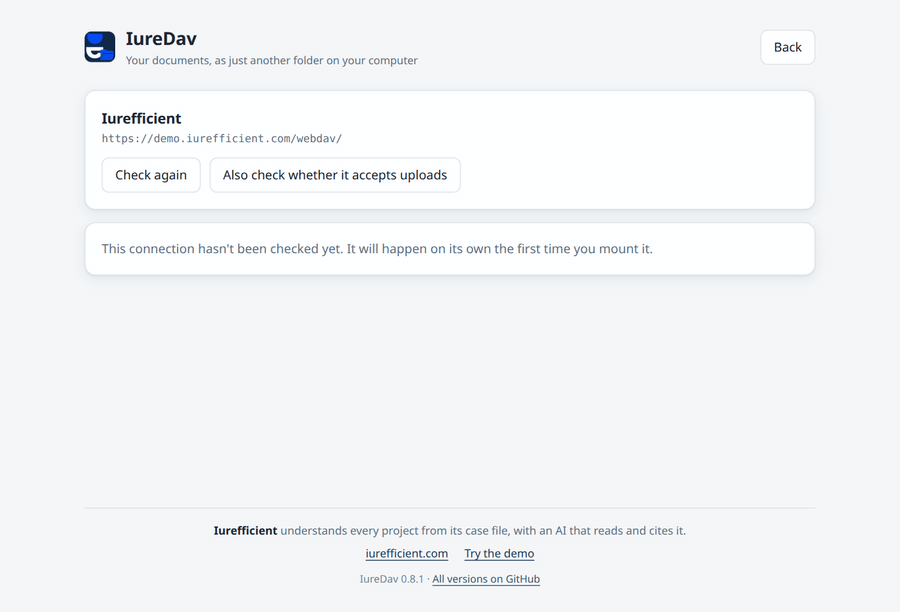
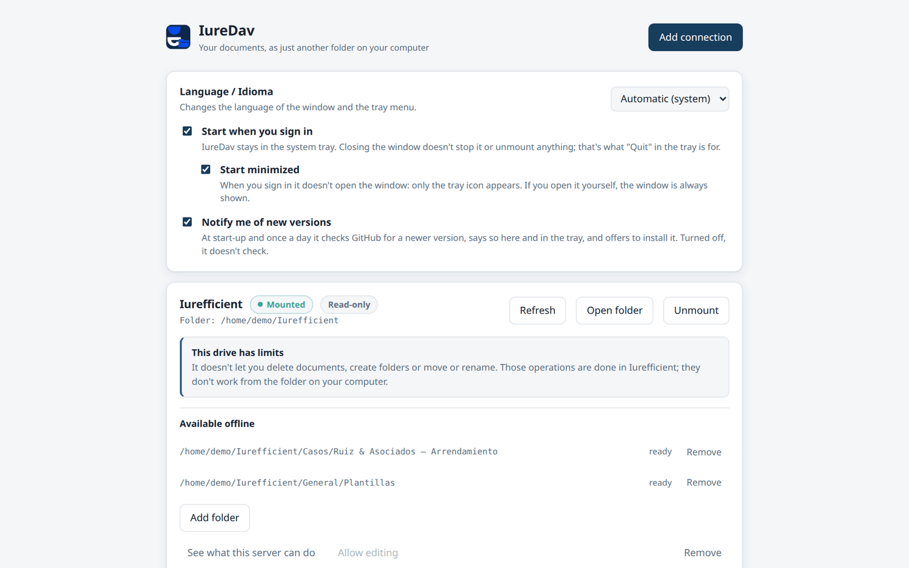
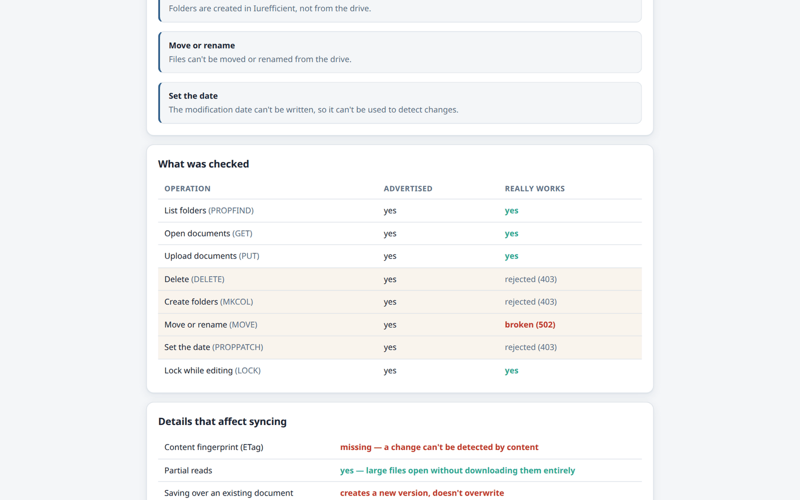
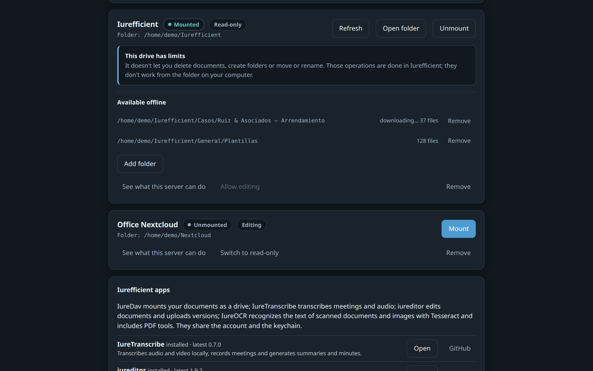
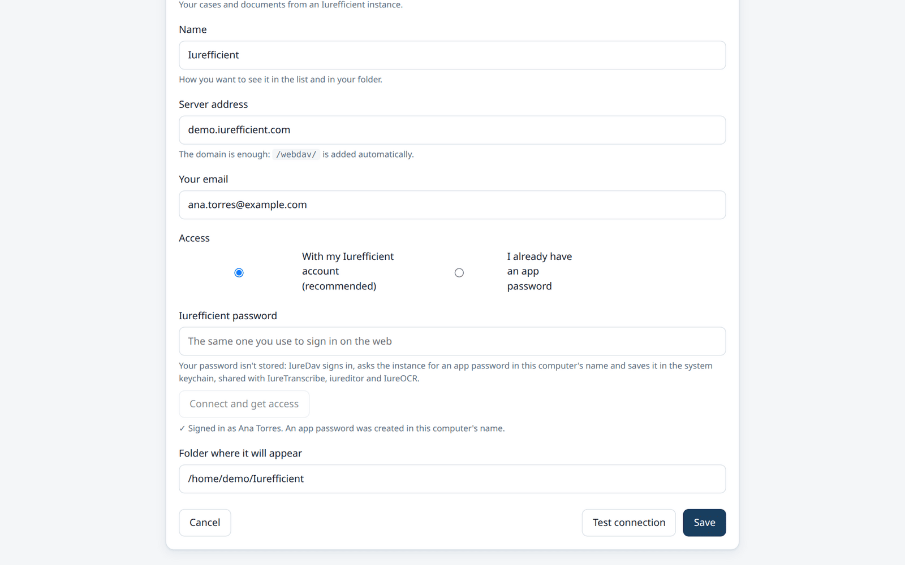

[Leer en español](README.es.md)

<p align="center">
  
</p>
<h1 align="center">IureDav</h1>
<p align="center">
  Your WebDAV server (or Iurefficient) as just another folder on your computer, mounted only after checking what the server really does.
</p>
<p align="center">
  <a href="https://github.com/ellaguno/iuredav/releases/latest"></a>
  <a href="https://github.com/ellaguno/iuredav/releases"></a>
  <a href="LICENSE"></a>
  
  <a href="https://github.com/ellaguno/iuredav/actions/workflows/ci.yml"></a>
</p>
<p align="center">
  <a href="https://github.com/ellaguno/iuredav/releases/latest"><b>Download for Linux · Windows · macOS</b></a>
</p>

<p align="center">
  
</p>

Mount a WebDAV server as a drive on your computer, Mountain Duck style. Linux,
macOS and Windows. With a profile optimized for **Iurefficient**.

Unlike other clients, IureDav **doesn't believe what the server advertises**: it
tests every operation, measures what really works, and from that works out how to
mount the drive and what to explain to you when something can't be done.

> **Status: in development.** The probe, mounting, the desktop interface, the
> system tray, autostart, the installers for all three platforms and offline
> folders all work.
>
> Really tested only on Linux. Windows and macOS **build and are packaged in
> continuous integration**. Windows has had some use on real machines (several
> fixes in the [CHANGELOG](CHANGELOG.md) come from it), much less than Linux;
> nobody has run the macOS build on a real Mac yet.

## Why IureDav

- **It measures instead of trusting.** Each WebDAV operation is tried for real;
  a server that promises `DELETE` or `MOVE` and then fails doesn't get to break
  the drive halfway through a copy or a rename.
- **Limits explained in plain words.** Not "403 on MKCOL" but "it doesn't let
  you create folders; that's done in Iurefficient", in English or Spanish.
- **Safe by default.** The drive is read-only until the probe confirms that the
  server accepts uploads and you turn editing on yourself.
- **Nothing extra to install on macOS or Windows.** rclone ships inside the app;
  macOS mounts through a local NFS server (no macFUSE) and the Windows installer
  brings WinFsp.
- **No telemetry.** It talks to your server and, for version checks, to GitHub.
  Passwords live in the system keychain.

## Screenshots

<table>
  <tr>
    <td width="50%"></td>
    <td width="50%"></td>
  </tr>
  <tr>
    <td>The Iurefficient drive mounted, with its limits spelled out.</td>
    <td>What the server advertises against what really works.</td>
  </tr>
  <tr>
    <td width="50%"></td>
    <td width="50%"></td>
  </tr>
  <tr>
    <td>Folders kept available offline (dark theme).</td>
    <td>New connection: sign in with your Iurefficient account, no app password to copy.</td>
  </tr>
</table>

## Features

- **Capability probe**: tries `PROPFIND`, `GET` and partial reads and, when you
  ask for it, `PUT`, `MKCOL`, `MOVE`, `DELETE`, `PROPPATCH` and `LOCK`; the
  measurement becomes the rclone mount options.
- **Two kinds of server**: Iurefficient, and any other WebDAV over HTTPS
  (Nextcloud, ownCloud, Synology, Seafile, `mod_dav`…).
- **Sign in with your Iurefficient account**: IureDav gets an app password in
  this computer's name and keeps it in the keychain it shares with
  IureTranscribe, iureditor and IureOCR. Signing in once serves all of them.
- **Offline folders**: mark a folder and it's downloaded so you can open it
  without internet.
- **Lives in the tray**: closing the window doesn't unmount; it starts with the
  session (minimized by default), and the drives that were mounted come back on
  their own at startup.
- **Updates from the app**: tells you about new versions and installs them,
  unmounting first.
- **`iuredav://` links**: `iuredav://montar?perfil=<id>` mounts a connection and
  `iuredav://nueva` opens the new-connection form, so another app or the instance
  can launch IureDav. A second launch focuses the window that's already open.
- **Interface in English and Spanish**, light or dark following the system.

## Download and install

Get the files from the [latest release](https://github.com/ellaguno/iuredav/releases/latest):

| System | File | Notes |
|---|---|---|
| Windows x64 | `IureDav_<version>_1-windows-x64.exe` (or `.msi`) | Installs WinFsp too if it's missing. |
| macOS 10.15+, Intel and Apple Silicon | `IureDav_<version>_2-macos-universal.dmg` | Universal; nothing else to install. |
| Linux x64, Debian/Ubuntu | `IureDav_<version>_3-linux-x64.deb` | Pulls in `fuse3`. |
| Linux x64, Fedora/openSUSE | `IureDav_<version>_3-linux-x64.rpm` | Needs FUSE 3 to mount. |
| Linux x64, any distribution | `IureDav_<version>_3-linux-x64.AppImage` | Make it executable and run it; needs FUSE 3 to mount. |

The `.sig` files and `latest.json` are for the in-app updater; you don't need
them.

**The installers are not code-signed.** On Windows, SmartScreen may say
"Windows protected your PC" / unknown publisher: click **More info → Run
anyway**. On macOS the app isn't notarized: the first time, right-click the app
and choose **Open**, or go to **System Settings → Privacy & Security → Open
Anyway**. The [code signing policy](#code-signing-policy) explains how the files
are built.

## Language

The interface is available in English and Spanish. It starts in **Spanish if the
operating system is in Spanish** and in English otherwise; you can change it in
the preferences card (*Language / Idioma*: automatic, English or Español). The
change applies immediately, including the tray menu and the notices coming from
the mount. The diagnostic command line (`iuredav`) stays in Spanish.

## Two kinds of server

| Profile | For | What it asks for |
|---|---|---|
| **Iurefficient** | Iurefficient instances | Just the domain; `/webdav/` is added. Your Iurefficient account (recommended) or an `iurdav_…` app password |
| **Other WebDAV server** | Nextcloud, ownCloud, Synology, Seafile, `mod_dav`… | The full URL of your WebDAV and your password |

Only **basic authentication over HTTPS** is supported for the WebDAV connection.
There is no support for NTLM (SharePoint) or OAuth flows, and none is planned.

With the Iurefficient profile, the recommended access is **with your account**:
you type your email and your Iurefficient password (and the two-step code if you
have one), IureDav signs in, asks the instance for an app password in this
computer's name and saves it in the system keychain. You never see the
`iurdav_…`, and the account password isn't stored. The app password and the
session live in the same keychain entry (service `iurefficient`) that
IureTranscribe, iureditor and IureOCR use, so if another app signed in first the
form comes with the domain and email already filled in. *I already have an app
password* is still there for the manual case, with a button that opens the
profile page of your instance where you generate it.

## Why the probe exists

Iurefficient's WebDAV server isn't a WebDAV over files: it's a custom provider
that exposes a virtual tree backed by the document database. And it **advertises
capabilities it doesn't have**: its `Allow:` header promises `DELETE`, `COPY`,
`MOVE` and `PROPPATCH`, but using them returns 403, 403, 502 and 403.

That isn't a cosmetic detail. A client that believes that advertisement plans with
it and fails when executing. With rclone it looks like this:

```
$ rclone backend features :webdav:          # unprotected
  Move     True        ← lie
  DirMove  True        ← lie
  Copy     True        ← lie
  Purge    True        ← lie

$ rclone moveto ...
ERROR : Server side directory move failed: DirMove MOVE call failed: 502 Bad Gateway
ERROR : Attempt 1/3 failed with 1 errors
```

That's why IureDav **doesn't read the advertisement to decide anything**. It tests
every verb, measures what the server really does, and from that measurement works
out how to mount the drive. If tomorrow the server fixes `DELETE`, the probe
detects it and the restriction goes away on its own.

## The desktop app

The interface turns the server's limits into something actionable: instead of
"doesn't allow delete, mkcol, move" it says **"it doesn't let you delete
documents, create folders or move or rename; those operations are done in
Iurefficient"**. The *See what this server can do* screen sets, row by row, what
the server advertises against what it delivers, and from there you can **check it
again**: the measurement is saved with the connection and doesn't expire, so a
server that changes isn't detected on its own.

The new-connection form probes **reading only**, so as not to leave a trace on a
server that may never even be saved. That leaves `PUT` as "not tested", and
without a confirmed `PUT` the mount is forced to read-only: that's why turning on
*Allow editing* offers to check uploads first, warning about the diagnostic file
that leaves on the server.

The window also has an *Iurefficient apps* card: which of the desktop apps are
installed on this computer, their latest published version, and where to open or
download them.

## Offline folders

Mark a folder and it's downloaded in full so you can open it without internet.
It's checked again every time you mount.

rclone **has no native "pin"**: what it has is a cache with an expiry and a
maximum size. IureDav walks the folder and reads every file through the mount,
which is what forces the VFS to download them and keep them in that cache. It's a
good approximation, not a guarantee: **if the cache fills up, eviction by age can
push out pinned content**.

The alternative approach — syncing to a real local folder — is ruled out
precisely because of what the probe measures: with no content fingerprint and no
reliable date, the comparison would fall back to looking at size only, which
doesn't detect an edited file that weighs the same.

## It lives in the tray

Like any agent of this kind, the usual thing is to mount when the computer starts
and not open the window again for weeks. That's why **closing the window doesn't
unmount or stop the program**: it just hides it. To really quit there's *Quit* in
the tray menu, which unmounts first.

If the desktop doesn't offer a tray, IureDav detects it and closing the window
does quit the program — otherwise there would be no way out.

With *Start when you sign in* turned on, IureDav starts **minimized**: only the
tray icon appears, without opening the window. That's the default, and it can be
turned off right below that option. It only affects starting with the session —
the autostart entry launches the program with `--autoarranque` —; opening it by
hand always shows the window, and without a tray it never hides either.

The connections that were mounted are **mounted again at startup** (when the
computer starts, or when IureDav is opened again); the ones you unmounted by hand
stay as they were. Quitting from the tray, shutting down or updating don't count
as unmounting. If there's no network yet, each connection is retried for a few
minutes and, if it doesn't make it, the window says so.

## New versions

At startup, and once a day while it stays in the tray, IureDav checks the latest
release of this repository. If it's newer than the installed one it says so in the
window and in the tray menu. **Update now** unmounts the drives, downloads the
signed update, installs it and restarts IureDav; the drives stay marked to come
back. It works with the AppImage, the `.deb` and the `.rpm` on Linux (the packages
install the same type you have and ask for the administrator password) and with
the Windows and macOS installers. The check is anonymous and can be turned off in
the preferences card.

## Part of the Iurefficient suite

| App | What it does |
|---|---|
| [IureTranscribe](https://github.com/ellaguno/iuretranscribe) | Local Whisper transcription, live recording with who-spoke, summaries and minutes. |
| [iureditor](https://github.com/ellaguno/iureditor) | WYSIWYG Markdown editor with Mermaid, LaTeX and PDF/DOCX export. |
| **IureDav** | Mount a WebDAV server (or Iurefficient) as a drive. |
| [IureOCR](https://github.com/ellaguno/iureocr) | Local OCR that turns scans into searchable PDFs. |
| [iureTI](https://github.com/ellaguno/iureTI) | IT asset discovery probe for the Iurefficient inventory. |

## Contributing

Issues and pull requests are welcome. Good first contributions:

- **Bug reports**, especially from Windows and macOS, which have had far less use
  than Linux. Say which system and installer you used and what the window said;
  run IureDav from a terminal with `RUST_LOG=iuredav_core=debug,iuredav_app=debug`
  to get a detailed log. If it's about a specific server, the output of
  `iuredav probe` against it helps — remove URLs, emails and folder names first
  (see [A note on data](#a-note-on-data)).
- **Translations**: a new interface language means a dictionary in `src/i18n.ts`
  plus the messages that come from Rust.
- **Documentation**: corrections and clarifications to this README.

To build and run it, see *Development* under [Technical details](#technical-details).

## Technical details

<details>
<summary><b>Command line (probe and mount without the window)</b></summary>

```bash
cargo build --workspace

# 1. See what your server can really do, and save the connection
IUREDAV_PASS='iurdav_...' ./target/debug/iuredav probe \
  --url https://YOUR-INSTANCE/webdav/ \
  --user you@email.com \
  --guardar-como work

# 2. Mount it (Ctrl+C to unmount)
./target/debug/iuredav mount work

# 3. Manage connections
./target/debug/iuredav perfiles
./target/debug/iuredav olvidar work
```

The password is stored in the system keychain, never in the profiles file. Add
`--escritura` to `probe` to also test `PUT`, `MKCOL`, `MOVE`, `DELETE`,
`PROPPATCH` and `LOCK`. (The diagnostic command line is in Spanish.)

**The mount is read-only until the probe confirms that the server accepts
writes**, and even then you have to ask for it with `--escritura`. Against
Iurefficient that's the right thing: deleting and renaming don't work, and every
save creates a new version of the document.

> **Careful with `--escritura`:** since the server rejects `DELETE`, the probe
> **can't clean up what it creates**. That's why it always writes to the same
> fixed path, `General/.iuredav-selftest.txt`, so that repeating the diagnostic
> generates versions of a single document instead of piling up orphan files.

The password is passed through `IUREDAV_PASS` on purpose: any other process on
the machine can read `argv`.

#### Without touching a real instance

There's a test double that mimics the measured behavior, lie included:

```bash
python3 tests/servidor-falso.py 8099 &
IUREDAV_PASS='iurdav_falso' ./target/debug/iuredav probe \
  --url http://127.0.0.1:8099/webdav/ --user prueba@ejemplo.com --escritura
```

It should report 4 advertised capabilities that don't exist, and exit with code 1.
That disagreement between the two columns *is* the proof that it works.

</details>

<details>
<summary><b>How it's put together</b></summary>

| Piece | What it does |
|---|---|
| `crates/iuredav-core/src/probe.rs` | Tests every WebDAV verb and produces the measurement. |
| `crates/iuredav-core/src/caps.rs` | Turns the measurement into rclone options. |
| `crates/iuredav-core/src/errors.rs` | Translates rclone failures into plain language, in English or Spanish. |
| `crates/iuredav-core/src/rclone.rs` | Supervises the sidecar that does the mounting. |
| `crates/iuredav-core/src/perfiles.rs` | Saved connections, with no secrets inside. |
| `crates/iuredav-core/src/secretos.rs` | Passwords in the system keychain. |
| `crates/iuredav-cli` | The `iuredav` binary. |

The mount is done by [rclone](https://rclone.org) as a helper process, controlled
through its remote API. Neither the WebDAV password nor that API's credentials go
through the command line: any user on the machine can read `/proc/PID/cmdline`
(permissions 444), while only its owner can read the environment (400). The names
and types of the options come from `rclone rc --loopback options/get`, which is
the authoritative list: durations are in nanoseconds, `CacheMode` is an integer
and the read chunk key is `ChunkSize`. Getting any of those three wrong breaks the
mount silently.

The Iurefficient account sign-in, the shared keychain and the *Iurefficient apps*
card come from the common connector
[`iurefficient-connect`](https://github.com/ellaguno/iurefficient-connect).

#### How it mounts on each system

| System | Mechanism | Needs installing | Where it appears |
|---|---|---|---|
| Linux | FUSE 3 | `fuse3` (the `.deb` requires it) | `~/Iurefficient` |
| macOS | rclone's local NFS server | **nothing** | `~/Iurefficient` |
| Windows | WinFsp | **nothing**: the installer bundles it and installs it if missing | drive `I:` |

macOS doesn't need macFUSE. rclone starts a local NFS server and the system mounts
it, so nobody has to install a kernel extension or authorize it in System
Preferences — which is the biggest installation hurdle for this kind of program.

The mechanism **isn't hard-coded**: when mounting, rclone is asked which
mechanisms it has (`mount/types`) and the first one from a per-platform preference
list is chosen. The names change between versions — `nfsmount` doesn't exist in
rclone 1.60 but does in 1.75 — and asking for one that isn't there gives an error
that doesn't help.

IureDav checks these requirements **before** trying to mount, and if one is
missing it explains which one and how to get it, instead of letting rclone fail
with a system message. The check is repeated every time the window gets the focus
back, so installing WinFsp or FUSE with IureDav open is enough.

</details>

<details>
<summary><b>Development</b></summary>

```bash
npm install
npm run tauri dev          # the desktop app

cargo test --workspace     # capabilities, error translator, profiles
cargo build --workspace
npx tsc --noEmit           # the frontend, in strict mode
python3 scripts/generar-iconos.py   # regenerates the icons from assets/
```

On Linux, the system tray needs a package that isn't installed yet:

```bash
sudo apt install libayatana-appindicator3-dev
```

The screenshots and the GIF in this README come from the real interface with the
Tauri backend mocked; [`scripts/readme-media/`](scripts/readme-media/) regenerates
them.

</details>

<details>
<summary><b>Building the installers</b></summary>

```bash
python3 scripts/descargar-rclone.py    # the rclone that gets bundled
npm ci
npm run tauri build
```

Produces `.deb`, `.rpm` and `.AppImage` on Linux; `.dmg` on macOS; `.msi` and
`.exe` on Windows. Continuous integration builds them for Linux x86-64, Windows
x86-64 and macOS, and keeps them as artifacts of each run.

The macOS `.dmg` is **universal**: a single installer valid for both Intel and
Apple Silicon. It's built on an Apple Silicon runner because GitHub's Intel ones
are being retired and jobs sit in the queue indefinitely. The two rclone binaries
are joined with `lipo` before packaging, because Tauri expects the external
binary already joined and doesn't combine it on its own.

rclone ships inside the package under the name **`iuredav-rclone`**, not
`rclone`. External binaries end up in `/usr/bin`, and there a plain `rclone` would
clash with the distribution's package: dpkg refuses to overwrite another package's
file, so installation would fail on any computer that already has it.

The Windows installer carries the official WinFsp MSI
(`python3 scripts/descargar-winfsp.py`) and runs it silently if the machine
doesn't have it; if Windows asks for a restart because of the driver, it says so
at the end. WinFsp's license (GPLv3 with an exception for free software) allows
redistributing its unmodified installer with free software like IureDav.

The macOS and Windows packages are **unsigned** (see
[Code signing policy](#code-signing-policy)). Signing them requires an Apple
Developer account and a code-signing certificate.

</details>

<details>
<summary><b>Publishing a version</b></summary>

```bash
python3 scripts/version.py            # see the current version and that it matches
python3 scripts/version.py 0.2.0      # change it in the three files
# write the 0.2.0 section in CHANGELOG.md
git commit -am "Versión 0.2.0"
git tag -a v0.2.0 -m "IureDav 0.2.0" && git push --follow-tags
```

The tag triggers the build for all three platforms and publishes a release with
the installers attached, the updater manifest (`latest.json`) and the notes taken
from the [CHANGELOG](CHANGELOG.md).

The tag has to be **annotated** (`-a`): `--follow-tags` doesn't push lightweight
ones, so with a plain `git tag v0.2.0` the `push` takes the commit, leaves the tag
on your machine and doesn't warn you. Nothing is published and it looks like it
was.

The version lives in three files — `Cargo.toml`, `package.json` and
`tauri.conf.json` — because each tool has its own. If they drift apart you get an
installer that says one version and contains another: the file name and the MSI
properties come from `tauri.conf.json`, not from the code. That's why CI checks
that they match, and publishing stops before building anything if the tag doesn't
match what the files say.

The artifacts each CI run leaves **expire after 14 days**; those of a release
don't expire.

</details>

<details>
<summary><b>The icon</b></summary>

It comes from `assets/iuredav_icon.png`. The script crops it, squares it and
scales it down to every size the packagers ask for.

Sizes below 64 px — system tray, taskbar, tab — use **only the mark, without the
"WebDAVs" wordmark**: at 16 px that text is an illegible smudge and it also takes a
third of the height, leaving the mark cramped. The Windows `.ico` is written by
hand so it can carry different art at each resolution, which is something Pillow
can't do.

Corners are rounded at 22 %, which is the radius of macOS icons. The tray one is
separate and **fully round**: there it sits next to the system icons, which are
circular on all three desktops. Rounding is always done at the final size —
rounding and then scaling down blurs the edge and leaves a halo of the background
color — and the Windows Store tiles stay square on purpose, because there the
system sets the shape.

</details>

## A note on data

This repository is public. Never include instance URLs, emails, `iurdav_…`
passwords or probe reports: the `Casos/` listings carry real case-file names. The
tests use the fake server, never a real instance. The screenshots use fictional
servers (`demo.iurefficient.com`, `dav.example.com`) and made-up names.

## Code signing policy

The installers are currently **not code-signed**:

- **Windows**: the `.exe` and `.msi` carry no Authenticode signature, so
  SmartScreen may show "Windows protected your PC" / unknown publisher. Choose
  **More info → Run anyway**.
- **macOS**: the `.dmg` is neither signed with an Apple Developer ID nor
  notarized. The first time, right-click the app and choose **Open**, or allow it
  in **System Settings → Privacy & Security → Open Anyway**.

What is signed are the **in-app updates**: each installer published for the
updater has a minisign signature (`.sig`), collected in `latest.json`, and the app
only installs an update whose signature matches the public key built into it.

Every release is built only by GitHub Actions from this repository
(`.github/workflows/release.yml`), from a tag whose version must match the code,
and published on the [releases page](https://github.com/ellaguno/iuredav/releases).
Download the installers only from there.

- **Maintainer:** Eduardo Llaguno ([@ellaguno](https://github.com/ellaguno)).

### Privacy policy

This program will not transfer any information to other networked systems unless
specifically requested by the user or the person installing or operating it.

Specifically, IureDav connects only to:

- the WebDAV server (an Iurefficient instance or any other) that the user
  configures, to mount it as a drive; the transfer is done by the bundled
  [rclone](https://rclone.org) (MIT), which talks only to that server. With the
  Iurefficient profile, signing in with the account also goes only to that
  instance;
- `api.github.com`, once at start-up and once a day while it stays in the tray, to
  check whether a newer release exists. This check is anonymous, downloads
  nothing and can be turned off in the preferences card;
- `api.github.com`, when the connection list is shown, to read the latest version
  of each Iurefficient desktop app for the *Iurefficient apps* card (anonymous,
  nothing is downloaded);
- `github.com`, only when the user clicks *Update now*, to download the signed
  update from this repository's releases.

It collects no telemetry and no usage statistics. Credentials are stored in the
operating system keychain, never in configuration files.

## License

Apache License 2.0 — see [LICENSE](LICENSE).
